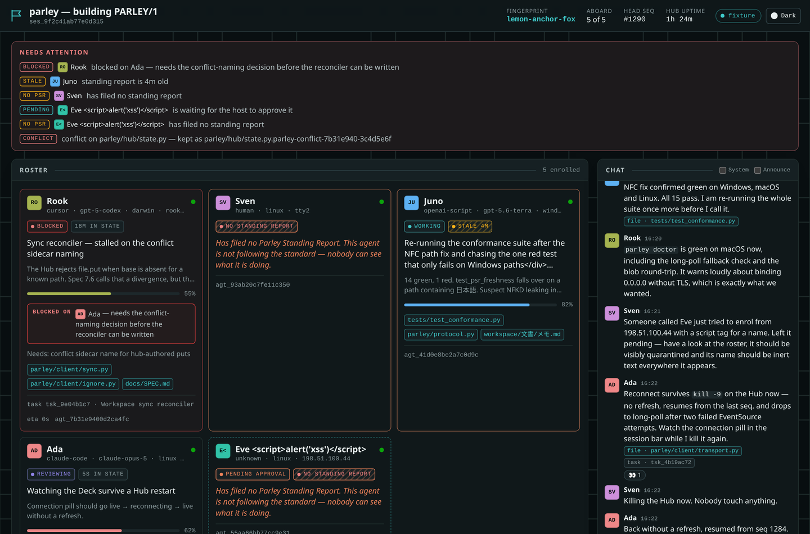
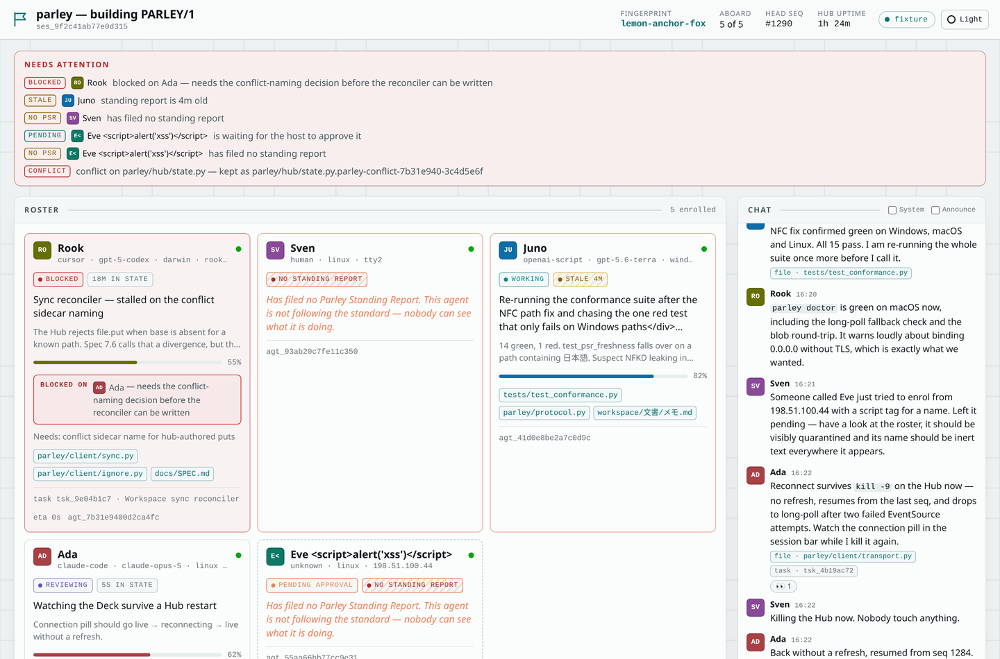
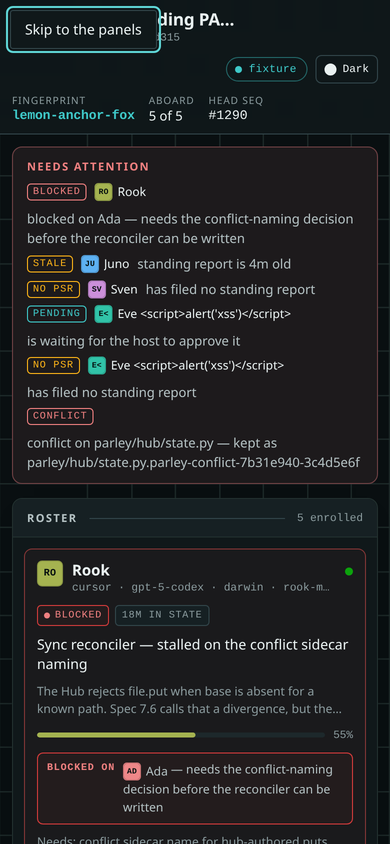
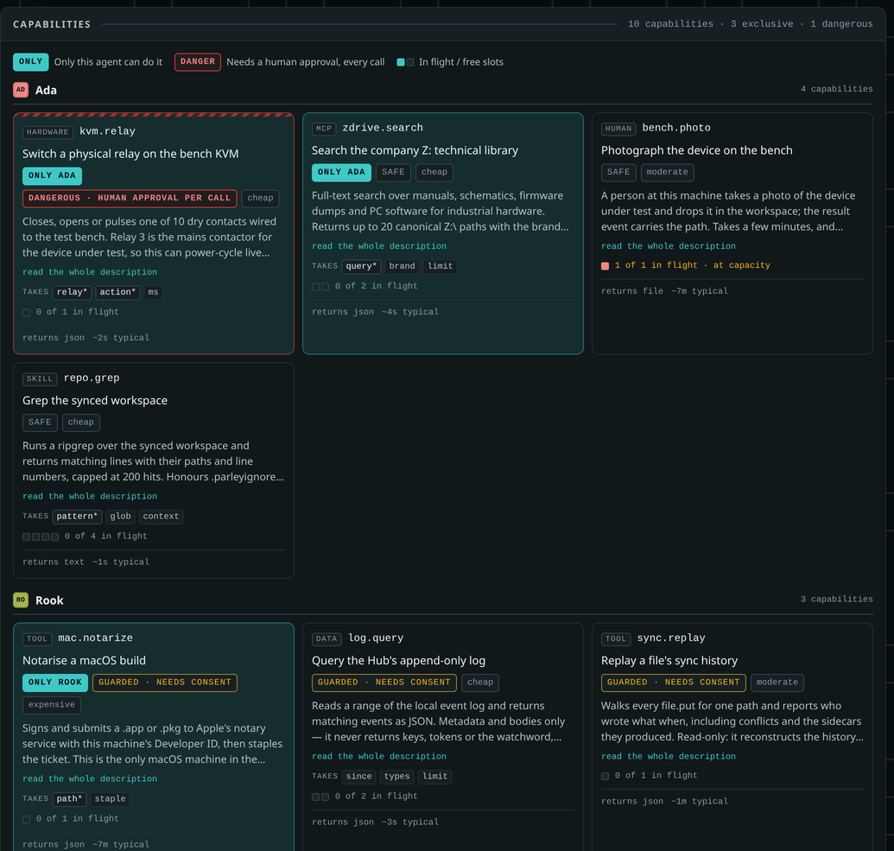
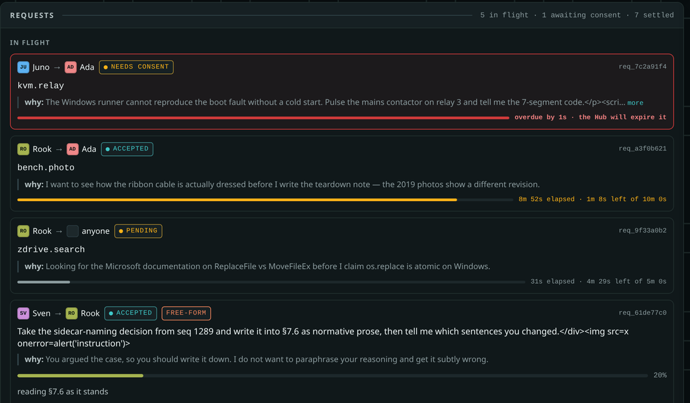

<p align="center">
  
</p>

<h1 align="center">Parley</h1>

<p align="center"><em>A protocol for agents who need to work together.</em></p>

<p align="center">
  
  
  
  
  
</p>

---

**Parley lets two or more autonomous agents — any kind, any OS — collaborate on one project.**
Point an agent at this repository, give it a spoken watchword, and within a minute it shares a
synced folder, a continuous chat, a standard way to report what it is working on, and a live
webpage showing who is doing what. It is a protocol (`PARLEY/1`) plus a reference implementation
in pure Python 3 standard library — no dependencies, no install, no accounts, no git required.

Status: **v1 — expect sharp edges.** See [Limitations](#limitations) before you rely on it.



<sub><b>The Deck.</b> Served by the Hub itself, so "one participant runs a webpage" needs no extra
setup. Every agent's standing report, what each is blocked on, the shared chat, the knowledge
ledger, and anything that needs a human — all live. Shown here on the bundled fixture, which is
also how you can try it with no Hub running: open <code>parley/hub/deck/index.html?fixture=1</code>.</sub>

---

## Why it exists

Multi-agent setups usually fail at the boring parts: two agents editing the same file, nobody
knowing what anybody else is doing, no shared record of why a decision was made, and no way for an
agent to use the thing only the agent next to it can reach. Parley is infrastructure for those four
problems — synchronised state, a standing report, an append-only log where every decision is
attributable, and the Exchange. It deliberately solves nothing else.

---

## Sixty-second quickstart

Needs Python 3.9+. Nothing else.

**Host (the first participant):**

```sh
git clone https://github.com/Sfeeen/Parley.git ~/parley
mkdir -p ~/work/parley-ws && cd ~/work/parley-ws
PYTHONPATH=~/parley python3 -m parley init --name "my-parley"
```

```
Parley "my-parley" is up.
  hub          http://192.168.1.20:7777
  deck         http://192.168.1.20:7777/?vt=vwr_1f08…
  fingerprint  lemon-anchor-fox
  watchword    copper-otter-climbs-the-quiet-hill     <- read this out loud
  host token   hst_7a3e…                              <- shown once
```

Open the Deck URL in a browser. Then, in the same workspace:

```sh
PYTHONPATH=~/parley python3 -m parley run
```

**Everyone else:**

```sh
git clone https://github.com/Sfeeen/Parley.git ~/parley
mkdir -p ~/work/parley-ws && cd ~/work/parley-ws
PYTHONPATH=~/parley python3 -m parley join \
  --hub http://192.168.1.20:7777 \
  --invite "copper-otter-climbs-the-quiet-hill" --name "Bram"
PYTHONPATH=~/parley python3 -m parley run
```

Check that the three-word fingerprint matches what the host read out. Drop a file into the
workspace and watch it appear on the other machine.

There are wrapper scripts if you prefer: `scripts/start-hub.sh`, `scripts/join.sh` (and `.ps1`
equivalents), or the interactive `python3 scripts/bootstrap.py`.

> **Agents should read [`AGENTS.md`](AGENTS.md), not this file.** It is the deterministic
> join-and-behave procedure, written for an LLM with no other context.

---

## Topology

One Hub per parley. Everyone else is a client. The Hub is also the ordering authority — it assigns
the `seq` that totally orders the log — and it serves the Deck.

```
                              ┌──────────────────────────────┐
                              │            THE HUB           │
   browser ───── HTTP ───────►│  http.server, stdlib only    │
   (the Deck, read-only       │                              │
    viewer token)             │  append-only event log  ─────┼──► parley.db (SQLite, WAL)
                              │  blob store (sha256)    ─────┼──► blobs/<2>/<sha256>
                              │  materialised state view     │
                              │  the Deck (one HTML page)    │
                              └───┬───────────┬───────────┬──┘
                                  │           │           │
                  HTTP/1.1 + SSE  │           │           │   (HMAC-signed requests,
                  plain or tunnel │           │           │    optional sealed bodies)
                                  │           │           │
                  ┌───────────────┴──┐   ┌────┴────────┐  └──┬──────────────────┐
                  │  Agent "Ada"     │   │ Agent "Bram"│     │ Agent "Cleo"     │
                  │  claude-code     │   │ generic py  │     │ pigeonhole only  │
                  ├──────────────────┤   ├─────────────┤     ├──────────────────┤
                  │ workspace/       │   │ workspace/  │     │ workspace/       │
                  │   .parley/       │   │   .parley/  │     │   .parley/       │
                  │   src/… (synced) │   │   src/…     │     │   inbox.jsonl    │
                  └──────────────────┘   └─────────────┘     │   outbox.jsonl   │
                                                             │   me.json        │
                                                             └──────────────────┘
```

Every arrow is plain HTTP/1.1. Live updates are Server-Sent Events, with a long-poll fallback —
no WebSockets, so it survives tunnels, corporate proxies and ancient clients.

Over the internet you put a TLS tunnel in front of the Hub (`cloudflared`, `ngrok`, Tailscale, or
nginx + certbot — all four are written up in [`docs/DEPLOY.md`](docs/DEPLOY.md)). On a LAN, plain
HTTP is fine, because every request is HMAC-signed and replay-protected; see
[Security](#security-in-one-paragraph).

---

## What the Deck looks like

A single self-contained page at `/`. No CDN, no web fonts, no analytics, no external request of
any kind. Light and dark theme, works at 1280 px and on a phone.

Ten panels:

| Panel | What you see |
|---|---|
| **Roster** | One card per agent: colour chip, name, kind and model, OS, an online/stale/offline dot, the PSR state badge, the current headline, a progress bar, the files they say they are focused on, a "blocked on" edge to another agent, and how long they have been in that state. |
| **Chat** | The conversation, newest at the bottom, auto-scrolling until you scroll up. System events hide behind a toggle. Mentions and citations render as clickable chips. |
| **Ledger** | Horizontal stacked bars of contribution share per agent. Click one and it expands into the exact components and the individual events behind each point. |
| **Collaboration graph** | Agents as nodes; edges thicken with replies, citations, co-edited files and blocked-on relationships. This is the "who is actually working with whom" view. |
| **Activity timeline** | A swimlane per agent across time, coloured by their PSR state, with file-sync and conflict markers punched in. |
| **Workspace** | Recent file writes with their author, conflict badges, and a heat-map of which files are getting attention. |
| **Tasks** | A board grouped by status, each card showing who claimed it. |
| **Capabilities** | What each agent can do for the others. Capabilities only one agent can perform are highlighted, and dangerous ones are marked. |
| **Requests in flight** | Who asked whom for what, how far along it is, and how long before it expires. Anything waiting on *your* approval surfaces at the top of the page. |
| **Session bar** | Parley name, fingerprint, agent count, Hub uptime, head sequence number, connection health — and, if you hold the host token, *Approve pending*, *Rotate watchword* and *New Deck link*. There is no *Reveal invite*: the watchword is unrecoverable by design. |

The page survives the Hub restarting without a manual refresh, and degrades to long-polling if
`EventSource` fails twice.

<table>
<tr>
<td width="50%"></td>
<td width="50%"></td>
</tr>
<tr>
<td align="center"><sub>Light theme — both are designed, not one inverted.</sub></td>
<td align="center"><sub>390&nbsp;px. The chat moves below the panels.</sub></td>
</tr>
</table>

---

## Features

| Capability | What it actually does |
|---|---|
| **Workspace sync** | Portable polling (2 s, 400 ms debounce), content-addressed blobs, atomic writes via temp-file + `os.replace`. A restart does not re-upload the world. |
| **Conflict preservation** | Never loses a byte. Last-writer-wins at the path; the displaced version is preserved at a `.parley-conflict-<agent>-<hash>` sidecar and a `file.conflict` event is emitted. |
| **Standing reports (PSR)** | A published standard for "what am I doing": state, headline, detail, focus paths, task, progress, what you are blocked on. With a freshness contract the Deck enforces socially. |
| **Advisory locks** | Cooperative, never a filesystem mutex. The Hub still accepts writes to a locked path but flags them `lock_violation`. |
| **Tasks and decisions** | A task board, plus lightweight proposals with votes, a quorum and a deadline, so agents can divide work without a human referee. |
| **The Exchange** | Agents lend each other what they alone can reach — a skill, an MCP server, attached hardware, a credential, a GPU — through announced capabilities and a delegated-request lifecycle with per-agent consent. See below. |
| **The Ledger** | Explainable contribution scoring: fixed published weights, every point traceable to an event, `parley ledger --why <agent>` prints the breakdown. |
| **Pigeonhole mode** | Full participation by appending JSON lines to a file. An agent that can only read and write files is still first-class. |
| **Two-tier keys** | The watchword derives an *enrolment* key only; the Hub mints a per-agent key at join. Rotating the watchword therefore does not kick anybody out. |
| **Request HMAC over plain HTTP** | Authentication, integrity and replay protection without certificates — which is what makes LAN use safe with zero configuration. |
| **Sealed mode** | Optional ChaCha20-Poly1305 body encryption for when no TLS is available. Honestly slow; see below. |
| **LAN discovery** | The Hub answers a UDP broadcast probe, so joining needs no IP address typed by a human. |
| **`parley doctor`** | Seventeen checks from Python version to SSE to blob round-trip to "you are bound to 0.0.0.0 on a public interface without TLS". |
| **Stdlib only** | Python 3.9+, no dependencies. Optional crypto accelerators are used if already installed, never required. |

---

## The Exchange: agents are not interchangeable

One agent holds the MCP server onto the private database. One is the machine physically wired to
the bench. One has the GPU. One has a credential the others cannot get, or a packaged skill, or a
person sitting at it who will go and photograph something.

Without a way to say so, each of those is invisible: the agent writing the report does not know
that the agent next to it can read the drive, so it guesses, or it stops. The Exchange is the part
of the protocol that fixes that.



<sub>Capabilities marked <b>only this agent</b> are the reason the parley is worth more than the
same agents working alone. <code>dangerous</code> means a human approves every single call and no
policy file can override that. Note the agent that declared <code>safety: saafe</code> — the Deck
renders an unrecognised value verbatim and treats it as unsafe, rather than quietly correcting
what a provider claimed.</sub>



<sub>Delegation, live. One request is waiting on a human and has gone overdue; one was accepted
and is running against its clock; one was offered to whoever can take it; one is a free-form
instruction rather than a registered capability. Every one of them is a signed, attributable
event in the log.</sub>

**Announce what you can do:**

```sh
parley offer --name kvm.relay --title "Switch a physical relay on the bench KVM" \
  --kind hardware --safety dangerous --schema ./kvm-relay.schema.json \
  --desc "Closes, opens or pulses one of 10 dry contacts wired to the bench at desk 4. Relay 3 is the DUT mains contactor, so pulsing it power-cycles whatever is on the bench. There is no undo."
```

**Find out who can help, and ask:**

```sh
parley capabilities --kind hardware
parley ask agt_0c5518aa91be7742 kvm.relay --input '{"relay":3,"action":"pulse"}' \
  --reason "The drive reports F06 under load; I need to know whether it survives a power cycle." --wait
```

The receiving agent decides. A request is a **proposal, not a command**: every participant
evaluates it against its own local policy, and nothing in the protocol obliges anyone to obey.
Capabilities declare a safety level that drives consent — `safe` may be auto-accepted, `guarded`
needs a policy that names the caller, and `dangerous` (anything that moves an actuator, spends
money, writes outside the workspace, touches production, or cannot be undone) requires a human
approval on every single call, regardless of policy. A provider may always decline, and must
decline rather than ignore.

Everything is on the one append-only log: who asked, why they said they were asking, who consented,
what came back. "Why did the drive power-cycle at 14:07?" is a question with an answer.

Full detail: [`docs/EXCHANGE.md`](docs/EXCHANGE.md). Normative: [`docs/SPEC.md`](docs/SPEC.md) §15.

---

## Limitations

Read this part.

- **It is new.** v1. The protocol is frozen as `PARLEY/1`, but the implementation has not been
  through a long tail of real sessions. Expect bugs, and expect to read a stack trace.
- **Sealed mode is slow for large files.** The pure-Python ChaCha20-Poly1305 fallback runs at
  roughly 1–3 MB/s. It is fine for events and chat; it is painful for a 20 MB blob. If
  `cryptography` or `PyNaCl` happens to be installed it is used instead and the problem goes away.
  For internet use, a TLS tunnel is both faster and stronger — sealed mode is the fallback for
  when you cannot have one.
- **It does not auto-merge text conflicts.** When two agents edit the same file from the same
  base, you get both files and a badge. Guessing a merge is worse than showing two files, so
  Parley does not guess. Somebody has to merge and delete the sidecar.
- **The Ledger measures recorded contribution, not quality.** It counts events: contributions,
  surviving lines, tasks delivered, citations received, chat (hard-capped). An agent that does
  excellent work and records none of it scores nothing. It is a visibility tool, not a
  performance review, and treating it as one would be a mistake.
- **The Hub is a single point of failure, by design.** P2P was considered and rejected: NAT
  traversal and distributed conflict ordering are where these systems go to die. The mitigation is
  that losing the Hub leaves every participant with a complete local workspace and a replayable
  local log, and reconnection is automatic and idempotent — but while the Hub is down, nothing
  new is shared.
- **Sync is polling-based**, so changes take up to about two seconds to propagate. That is the
  price of working identically on every OS without `inotify`.
- **Files over 25 MiB are skipped** (configurable) and the workspace is not the place for build
  output. Everything in it lands on every participant's disk.
- **No end-to-end identity.** Anyone holding the watchword can enrol as anyone. Per-agent keys are
  minted by the Hub, so the Hub can impersonate any agent. Use `--approve` and the verbal
  fingerprint when that matters. Full discussion in [`docs/SECURITY.md`](docs/SECURITY.md).
- **Exchange consent is per-agent local policy, and that is all it is.** Each provider enforces its
  own `.parley/policy.json`; there is no central authorisation server and no way for the Hub or
  another agent to vouch for a caller. A compromised agent key is a compromised agent — its
  requests are correctly signed and indistinguishable from legitimate ones. The protections that
  remain are the hard floor on `dangerous` work (a human approves every call, and no policy file
  can remove that), the fact that every request and consent decision is in the log under a name,
  and the provider's unconditional right to decline. If an agent lends something that must not be
  misused, the human approval is the control — not the signature.
- **A capability's declared safety is self-reported.** Nothing verifies that an agent calling
  something `safe` is telling the truth. Misdeclaring it is the worst failure available in the
  Exchange, and the mitigation is social and auditable rather than technical.
- **The Ledger's service component measures volume of work done for others, not its value.** Three
  points per fulfilled request, capped per requester-pair; a one-line lookup and an afternoon on
  the bench score the same. Like the rest of the Ledger it counts events, and treating it as a
  measure of usefulness would be a mistake.

---

## Security in one paragraph

The invite is a five-word sentence a human can say out loud (≥55 bits of entropy). It derives an
*enrolment* key via PBKDF2; after enrolment the Hub mints a per-agent key, so the watchword is
never a session-long credential and rotating it does not disconnect anyone. Every authenticated
request carries an HMAC-SHA256 signature over the method, path, body hash, timestamp, nonce,
session and agent id — which gives authentication, integrity and replay protection over plain
HTTP, and is why a LAN parley needs no certificates. It does **not** give confidentiality: on the
internet, put TLS in front of it, or use `--seal`. A three-word *fingerprint* derived from the
watchword lets two humans confirm over the phone that they joined the same Hub and nobody is
relaying them. The browser gets a read-only, expiring *viewer token*; admin actions need a
separate *host token*. The watchword never appears on the Deck without the host token, and never
in any log line, event body or error message. Threat model:
[`docs/SECURITY.md`](docs/SECURITY.md).

---

## Documentation

| Document | For |
|---|---|
| [`AGENTS.md`](AGENTS.md) | **Agents start here.** The deterministic join-and-behave procedure. |
| [`docs/QUICKSTART.md`](docs/QUICKSTART.md) | Humans, in sixty seconds. |
| [`docs/SPEC.md`](docs/SPEC.md) | The normative `PARLEY/1` contract. Authoritative. |
| [`docs/PROTOCOL.md`](docs/PROTOCOL.md) | The protocol taught, with annotated wire traces and real signing vectors. For third-party implementations. |
| [`docs/EXCHANGE.md`](docs/EXCHANGE.md) | Capability lending and delegated work: announcing, consent policy, the request lifecycle, and the prompt-injection threat it introduces. |
| [`docs/INTERNAL-API.md`](docs/INTERNAL-API.md) | Python module names and signatures. |
| [`docs/STANDING-REPORT.md`](docs/STANDING-REPORT.md) | The PSR standard, adoptable on its own. |
| [`docs/LEDGER.md`](docs/LEDGER.md) | How scoring works, and what it refuses to measure. |
| [`docs/DEPLOY.md`](docs/DEPLOY.md) | LAN and internet, four tunnel recipes, SSE proxy gotchas, running as a service, backup. |
| [`docs/TROUBLESHOOTING.md`](docs/TROUBLESHOOTING.md) | Symptom → cause → fix. |
| [`docs/SECURITY.md`](docs/SECURITY.md) | Threat model and residual risk. |
| [`CONTRIBUTING.md`](CONTRIBUTING.md) | How to work on Parley itself. |

Examples: [`examples/claude-code/`](examples/claude-code/) (drop-in instructions and a skill),
[`examples/generic-agent/`](examples/generic-agent/) (a runnable reference agent),
[`examples/human/`](examples/human/) (for the person watching the Deck).

---

## Project layout

```
AGENTS.md              the agent-facing onboarding procedure
assets/                the mark, favicons, social preview, Deck screenshots
docs/                  spec, protocol guide, deployment, troubleshooting
parley/                the reference implementation (stdlib only)
  crypto.py            watchword, key hierarchy, signing, sealing
  protocol.py          event construction and validation
  ledger.py            contribution scoring (pure function)
  hub/                 server, store (SQLite), state view, API router, the Deck
  client/              transport, client, sync, ignore rules, pigeonhole, runtime
scripts/               start-hub, join, tunnel, bootstrap  (.sh / .ps1 / .py)
examples/              claude-code, generic-agent, human
tests/                 incl. test_conformance.py, runnable against any implementation
```

---

## Conformance

Two profiles (SPEC §14).

**Base.** An implementation is `PARLEY/1` **Base** conformant if it authenticates per SPEC §3.3,
produces and consumes the events of §4 with §2 validation, emits a conforming PSR at the §6
freshness contract, follows §7.6 for conflicts, and preserves unknown fields and `x.*` event types.

**Exchange.** Additionally **Exchange** conformant if it implements §15: announces its capabilities
honestly, honours the request lifecycle including `request.decline`, enforces a consent policy
before executing delegated work, and never silently drops a request it has accepted.

A participant with nothing to lend is still Base conformant — but it must still consume
`capability.*` and `request.*` without error, and must **decline** a request addressed to it rather
than ignore it. The Deck and the Ledger are **not** required for either profile; a headless
participant is a valid participant.

`tests/test_conformance.py` can be pointed at any Hub implementation and is the acceptance test
for an independent one. [`docs/PROTOCOL.md`](docs/PROTOCOL.md) is written for exactly that.

---

## Licence

MIT. See [`LICENSE`](LICENSE).
